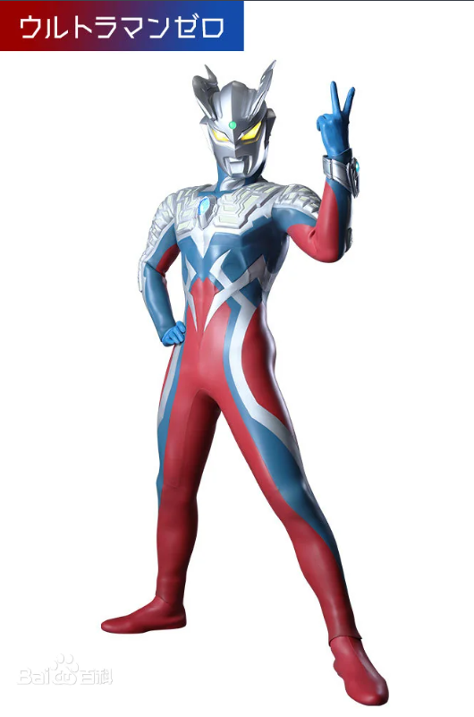
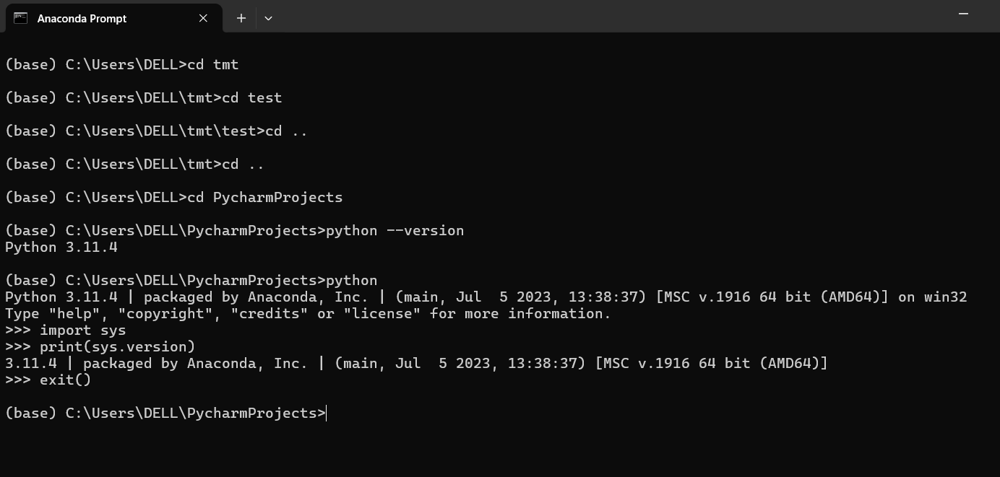
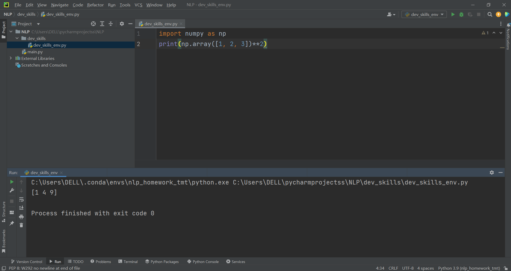

# 赛罗的自我介绍



大家好，我是**赛罗**，我的身份是*奥特赛文的儿子，光之国新一代的年轻奥特战士。曾因年少叛逆意图触碰等离子火花塔的能量核，险些酿成大错，之后赛文便把我托付给雷欧奥特曼训练，目的是塑造我强大的内心。后从奥特之王口中得知自己的身世，并和其他奥特战士们成功拯救了被贝利亚奥特曼险些毁灭的光之国。*。以下是我的自我介绍：

---

## 基础档案

### 外貌特征
 - 外表帅气，不同的是上半身为蓝色，下半身为红色，M78星云的奥特曼从未有过的色调。
    + 在K76星被雷欧训练过后战斗力提升不少，头部有着两个头镖。

## 我的好朋友
1. 红莲火焰
2. 镜子骑士
3. 捷德奥特曼
4. ......还有很多

### 重要坐标
[光之国](https://baike.baidu.com/item/M78%E6%98%9F%E4%BA%91/20353950?fromModule=lemma_inlink)
[终极赛罗警备队](https://baike.baidu.com/item/%E7%BB%88%E6%9E%81%E8%B5%9B%E7%BD%97%E8%AD%A6%E5%A4%87%E9%98%9F/23443555?fromModule=lemma_inlink)
### 日常作息表
| 时间              |        事项         |
|:----------------|:-----------------:|
| 6:00am-8:00am   | 训练时间（随时应对邪恶势力的挑战） |
| 8:00am-10:00am  |    巡逻宇宙，维护世界和平    |
| 10：00am-12:00am |     与伙伴交流战斗经验     |
| 12:00am-14:00pm |      休息，补充能量      |
| 14:00pm-18:00pm |  执行任务，处理宇宙中发生的事务  |
| 18:00pm-20:00pm |      与伙伴一起放松      |
| 20:00pm-6:00am  |        休息         |


### 人生信条
> 就算失去了同伴，就算内心沉浸在黑暗之中，只要还有需要我守护的东西，我就会再次站起来。没错，因为我是奥特曼。
>> 不管多么艰苦的时候，也不要忘记，闪耀的未来，就在你眼中啊！
>>> 找我打架，你还早了两万年呢。

---

## 我的专业是人工智能

## 我最喜欢的一段代码
   ```
import numpy as np
print(np.array([1, 2, 3]) ** 2)
   ```
其中执行``print(np.array([1, 2, 3]) ** 2)``可输出结果。

### 我最喜欢的环境管理工具是conda


### 我可以在IDE上使用我建立的虚拟环境


